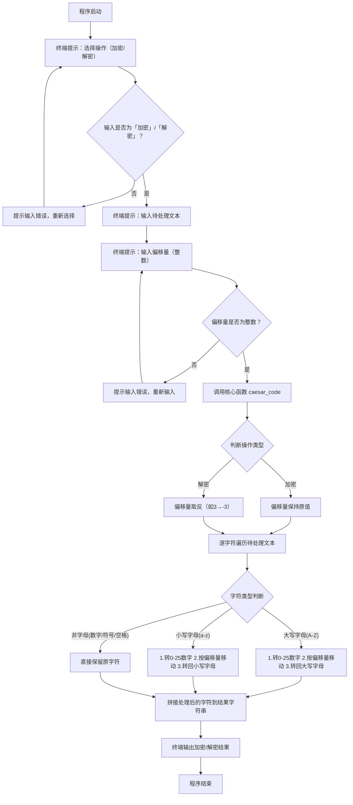

# 凯撒密码加密解密工具
该工具基于 Python 实现凯撒密码核心功能，仅对英文字母（大小写）进行加密/解密偏移处理，数字、符号、空格等非字母字符完全保留，内置输入合法性校验，提供交互式操作界面。
## 组员:
 候路科2241314536
 李昊禹2242316008
### 一、程序流程图

### 二、程序运行说明
<!-- 核心模块说明：该部分面向零基础用户，从环境准备到实际运行、输入规则、结果验证，全流程拆解程序使用方法，确保新手可按步骤独立操作 -->

#### 2.1 运行环境
<!-- 子节注释：明确程序运行的基础依赖，无第三方库要求，降低使用门槛 -->
- 编程语言版本：Python 3.x
- 适配操作系统：Windows、macOS、Linux 均可运行，无系统兼容性限制
- 第三方依赖：无，仅使用 Python 原生内置函数即可运行

#### 2.2 运行步骤
<!-- 子节注释：分5步拆解运行流程，每一步对应具体操作指令，覆盖“保存代码-打开终端-定位路径-启动程序-交互操作”全链路 -->
1. **代码保存**：将凯撒密码的 Python 代码复制到文本编辑器（如 VS Code、记事本），保存为 `.py` 格式文件（建议命名为 `caesar_cipher.py`，方便终端调用）；
2. **终端打开**：
   - Windows 系统：按下 `Win+R` 组合键，输入 `cmd` 回车打开命令提示符；或直接使用 VS Code 内置终端（快捷键 `Ctrl+`）；
   - macOS/Linux 系统：打开系统自带的「终端（Terminal）」应用；
3. **路径定位**：在终端中输入 `cd 代码文件所在文件夹路径`（例如代码保存在桌面，输入 `cd Desktop`），回车进入代码所在目录；
4. **程序启动**：在终端中输入命令 `python caesar_cipher.py` 并回车，启动交互式程序；
5. **交互操作**：按照终端的文字提示，依次完成操作选择、文本输入、偏移量输入，程序自动计算并输出结果。

#### 2.3 输入要求说明
<!-- 子节注释：明确每一步输入的格式、合法范围、错误提示，避免因输入格式错误导致程序异常，附清晰的合法/非法示例对比 -->
程序运行后会分三步引导输入，所有输入均内置合法性校验，输入错误会触发提示并要求重新输入，具体规则如下：

| 输入步骤       | 输入内容要求                          | 合法输入示例       | 非法输入示例       | 错误提示信息                                                         |
|----------------|---------------------------------------|--------------------|--------------------|----------------------------------------------------------------------|
| 操作选择       | 仅允许输入中文「加密」或「解密」| 加密 / 解密        | 加 / 解 / encrypt  | 输入错误！只能输入“加密”或“解密”，请重新输入。|
| 待处理文本     | 任意文本（字母、数字、符号、空格均可） | Hello, Python! 666 | 无（无输入限制）| 无（文本无格式/长度限制，非字母字符直接保留）                         |
| 偏移量         | 任意整数（正整数/负整数/0均可）| 3 / -5 / 0         | 三 / 3.5 / abc     | 输入错误！偏移量必须是整数，比如3、5、-2，请重新输入。|

#### 2.4 完整运行示例
<!-- 子节注释：提供加密、解密两个完整的运行示例，还原终端交互全过程，新手可对照示例验证自己的操作结果是否正确 -->
##### 示例1：加密操作
```bash
请选择操作：输入 加密 或 解密：加密
请输入要加密的文本：Hello, Python! 666
请输入偏移量（任意整数，比如3）：3
加密结果为：Khoor, Sbwkrq! 666
```
##### 示例2：解密操作
```bash
请选择操作：输入 加密 或 解密：解密
请输入要解密的文本：Khoor, Sbwkrq! 666
请输入偏移量（任意整数，比如3）：3
解密结果为：Hello, Python! 666
```
